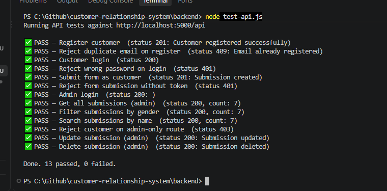

# Revotec — Customer Form Management System

A full-stack web application with JWT-based authentication, role-based access
control (CUSTOMER / ADMIN), and a CRUD form submission system with filtering
and search — built as a technical assignment for Revotec.

## Features

- Customer registration and login (JWT access + refresh tokens)
- Separate admin login, restricted to ADMIN role only
- Protected admin-creation endpoint with an auto-generated password
- Authenticated customers can submit a personal details form
- Admins can view, search, filter, edit, and delete all submissions
- Route-level protection via JWT middleware and role guards

## Tech Stack

| Layer     | Technology                                  |
|-----------|----------------------------------------------|
| Frontend  | React.js (Vite)                              |
| Backend   | Node.js, Express.js                          |
| Database  | MySQL (via Sequelize ORM)                    |
| Auth      | JSON Web Tokens (access + refresh), bcrypt   |

## Project Structure

```
customer-relationship-system/
├── backend/
│   ├── config/db.js          # Sequelize MySQL connection
│   ├── controllers/          # authController.js, submissionController.js
│   ├── middleware/auth.js    # verifyToken, requireRole
│   ├── models/               # User.js, Submission.js
│   ├── routes/                # auth.js, submissions.js
│   ├── seed-admin.js         # creates the first admin account
│   ├── reset-admin-password.js
│   ├── test-api.js           # automated endpoint test script
│   └── server.js
└── frontend/
    └── src/
        ├── pages/            # Home, CustomerLogin, CustomerRegister,
        │                     # AdminLogin, Application, AdminDashboard
        ├── components/       # Footer
        ├── context/          # AuthContext
        ├── api/axios.js
        └── styles/theme.css
```

## Setup Instructions

### Prerequisites
- Node.js 18+
- MySQL server running locally (or a reachable instance)

### 1. Clone the repository
```bash
git clone <your-repo-url>
cd customer-relationship-system
```

### 2. Backend setup
```bash
cd backend
npm install
```

Create a `.env` file in `backend/` (see [Environment Variables](#environment-variables) below), then create the MySQL database:
```sql
CREATE DATABASE revotec_db;
```

Start the backend:
```bash
npm run dev
```
The API runs on `http://localhost:5000` by default.

### 3. Seed the first admin account
Since creating an admin requires an already-authenticated admin, run this once to bootstrap the first one:
```bash
node seed-admin.js
```
This creates `admin@gmail.com` / `Admin1234` by default (edit the constants at the top of the file, or pass `ADMIN_EMAIL` / `ADMIN_PASSWORD` as environment variables, to use different credentials).

If that account already existed with a different password, reset it instead:
```bash
node reset-admin-password.js
```

### 4. Frontend setup
```bash
cd ../frontend
npm install
npm run dev
```
The app runs on `http://localhost:5173` by default.

## Environment Variables

Create `backend/.env` with the following (see `.env.example`):

```env
PORT=5000

DB_HOST=localhost
DB_USER=root
DB_PASSWORD=your_mysql_password
DB_NAME=revotec_db

JWT_ACCESS_SECRET=replace_with_a_long_random_string
JWT_REFRESH_SECRET=replace_with_a_different_long_random_string
JWT_ACCESS_EXPIRY=15m
JWT_REFRESH_EXPIRY=7d
```

## API Endpoint Documentation

Base URL: `http://localhost:5000/api`

### Auth

| Method | Endpoint             | Access              | Description                                      |
|--------|-----------------------|---------------------|---------------------------------------------------|
| POST   | `/auth/register`      | Public              | Register a new customer                           |
| POST   | `/auth/login`         | Public              | Customer login (CUSTOMER role only)               |
| POST   | `/auth/admin/login`   | Public              | Admin login (ADMIN role only)                     |
| POST   | `/auth/admin/create`  | Admin (JWT required)| Create a new admin with an auto-generated password|
| POST   | `/auth/refresh`       | Public (valid refresh token) | Issue a new access + refresh token pair  |

**Register** — `POST /auth/register`
```json
{ "email": "customer@example.com", "password": "1234", "confirmPassword": "1234" }
```

**Customer / Admin login** — `POST /auth/login` or `POST /auth/admin/login`
```json
{ "email": "customer@example.com", "password": "1234" }
```
Response:
```json
{ "accessToken": "...", "refreshToken": "...", "user": { "id": 1, "email": "...", "role": "CUSTOMER" } }
```

**Create admin** — `POST /auth/admin/create` (requires `Authorization: Bearer <admin accessToken>`)
```json
{ "email": "newadmin@example.com" }
```
Response includes the generated password once:
```json
{ "message": "Admin created successfully", "admin": { "id": 2, "email": "...", "role": "ADMIN" }, "generatedPassword": "a1b2c3d4e5f6" }
```

### Submissions

| Method | Endpoint                          | Access               | Description                              |
|--------|------------------------------------|-----------------------|-------------------------------------------|
| POST   | `/submissions`                     | Customer (JWT)         | Submit a new form                         |
| GET    | `/submissions`                     | Admin (JWT)            | Get all submissions                       |
| GET    | `/submissions?gender=FEMALE`       | Admin (JWT)            | Filter submissions by gender              |
| GET    | `/submissions?search=john`         | Admin (JWT)            | Search by first/last name (partial, case-insensitive) |
| PUT    | `/submissions/:id`                 | Admin (JWT)            | Update a submission by ID                 |
| DELETE | `/submissions/:id`                 | Admin (JWT)            | Delete a submission by ID                 |

**Submit form** — `POST /submissions` (requires customer `Authorization: Bearer <token>`)
```json
{
  "firstName": "Dulakshi",
  "lastName": "Ekshani",
  "email": "dulakshi@example.com",
  "gender": "FEMALE",
  "mobileNumber": "0771234567",
  "address": "Colombo, Sri Lanka",
  "feedback": "Optional feedback text"
}
```

All endpoints return standard HTTP status codes (`200`, `201`, `400`, `401`, `403`, `404`, `409`, `500`) with a JSON `message` field describing the result.

## Testing

An automated Node.js test script (`backend/test-api.js`) exercises the full
API surface end to end: registration, duplicate-email rejection, customer
login, wrong-password rejection, form submission, unauthorized-submission
rejection, admin login, get/filter/search submissions, role-guard
enforcement, update, and delete.

Run it with the backend server already running:
```bash
cd backend
node test-api.js
```

Sample output:


## Manual Testing (VS Code REST Client)

A `backend/api-tests.http` file is also included for manually testing each
endpoint one at a time using the [REST Client](https://marketplace.visualstudio.com/items?itemName=humao.rest-client)
VS Code extension.
